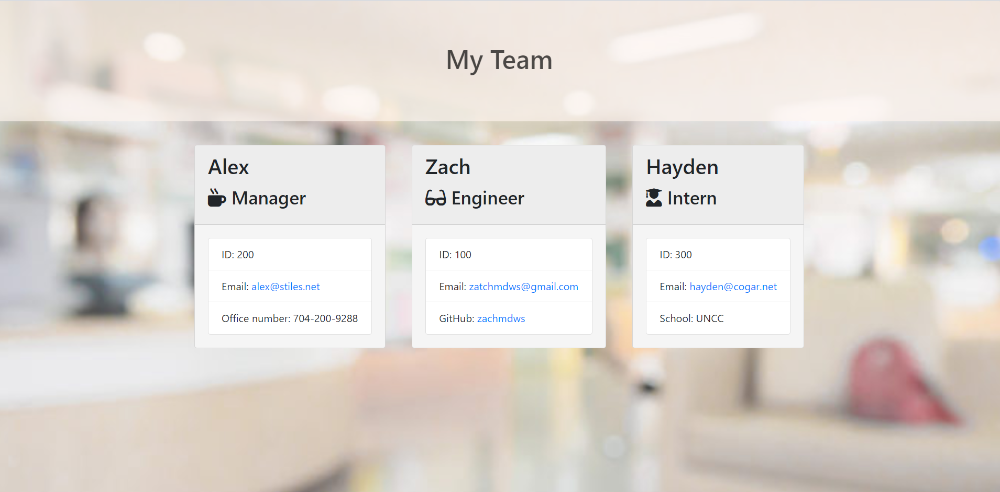

# Employee-Template-Engine

A simple CLI application that allows an employer to enter in different types of employees' names, numeric id's and emails. Depending on the employee the employer may choose 3 roles (intern, engineer and manager) to specificy other information such as the intern's school, manager's office number and the engineer's Github profile page. All of this information is then taken and a pre-styled HTML page is rendered displaying the given information in a sleek fashion.

